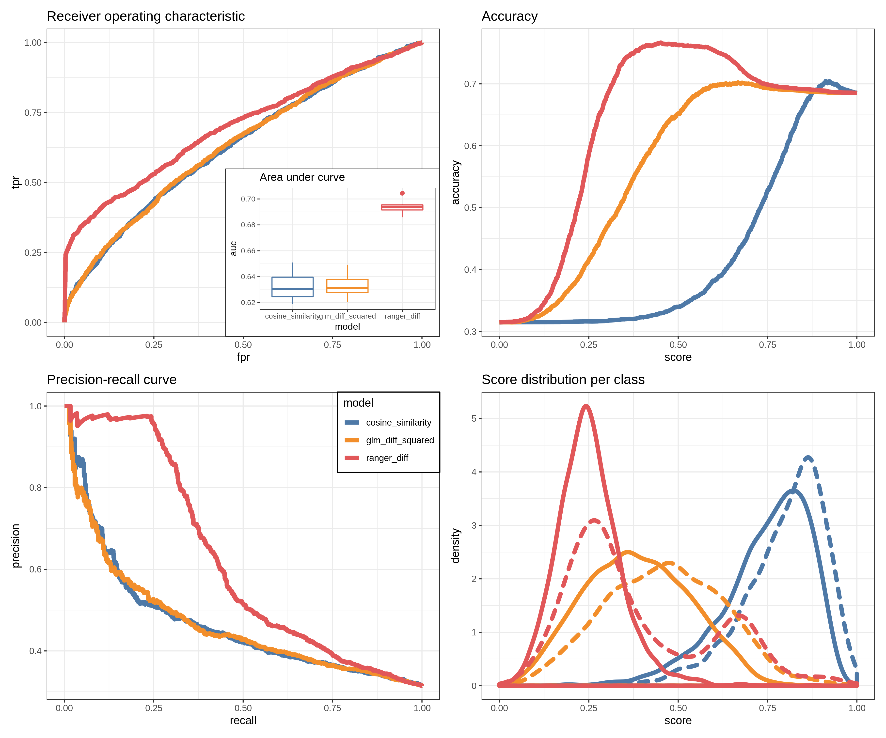

# 10 years challenge

You probably heard about #10yearschallenge and conspiracy theories about Facebook using it for training its facial recognition. If Facebook can do this, why not me? My goal in this project is to create a model that will compare two pictures to decide if both features the same person.

**Disclaimer:** This is a pet project to toy with neural networks and has no intention to utilize gathered data in any harmful way.

## Workflow

The project execution is controled via `Makefile`. Currently implemented steps are:

1. `get_photos` - scrapes instagram photos with a specified #hashtag. Done via [`instagram-scrapper`](https://github.com/rarcega/instagram-scraper).
1. `prepare_faces` - utilizes [`opencv`](https://github.com/ropenscilabs/opencv) R package (R wrapper of the [`OpenCV`](https://opencv.org/) library) to detect faces and prepare faces-only data set for the model.
1. `create_embeddings` - creates embedding vertors of length 128 for faces based on [Keras implementation](https://github.com/iwantooxxoox/Keras-OpenFace) of  [`OpenFace`](https://github.com/cmusatyalab/openface) library.

## Notes on software

* [`instagram-scrapper`](https://github.com/rarcega/instagram-scraper) requires to have account on Instagram
* [`opencv`](https://github.com/ropenscilabs/opencv) requires [`OpenCV`](https://opencv.org/) to be at leas version `3.4`
* Loading of pretrained model *with `Lambda` layers* in Keras from `.h5` requires the model to be built and loaded under same vesrion (eg. `3.5` vs. `3.7`). Thus I forked  [Keras-OpenFace](https://github.com/iwantooxxoox/Keras-OpenFace) and reruned model convertion undet `python 3.7`

## TO DO:

- [x] Get photos
- [x] Extact faces
- [x] Create embeddings
- [x] Create model performance summary function
- [x] Get baseline (cosine distance of embeddings)
- [ ] Try few models:
  - [x] Logistic regression
  - [ ] Random forest
  - [ ] Boosting
  - [ ] Neural nets
  - [ ] ...
- [ ] Try affine transformation during faces extraction step (based on eyes detection)
- [ ] Publish model:
  - [ ] As Shiny app
  - [ ] As API
  
## Current models performance

